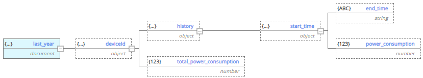

# Smart Living Server

## Project Overview

The Smart_Living_Server repository provides the server-side logic for managing backend operations in the Smart Living system. It integrates with Firebase services such as Firestore, Realtime Database and Firebase Authentication and includes various HTTP and scheduled functions to facilitate user data management, device power consumption monitoring and historical data management. The server functions aim to support real-time interactions and periodic maintenance of smart device data, improving overall system reliability and user experience.

## Key Features

- **User Data Cleanup:** An HTTP-triggered function (cleanup_user_data) is implemented to delete user-related data from Firestore and Realtime Database, including device, room, and space data.
- **Real-time Device History Updates:** A Firestore-triggered function (on_device_history_written) monitors updates to device history and automatically copies data to relevant collections for different periods (weekly, monthly, yearly), ensuring historical data is organized and accessible for tracking energy usage.
- **Power Consumption Monitoring:** The system calculates and updates the total power consumption of devices by aggregating power usage from historical data. This is updated for different time periods ("last week", "last month", "last year") whenever device history changes.
- **Data Retention and Cleanup:** Scheduled tasks periodically remove outdated device history data and recalculate total power consumption for each device to ensure accurate reporting and prevent data buildup.
- **Scheduled Maintenance:** A scheduler function (scheduled_cleanup) runs daily at midnight to automate the deletion of old documents and trigger power consumption updates, maintaining data integrity and minimizing storage requirements.

## Technologies Used

- **Firebase Cloud Functions:** Serverless backend functions to handle real-time data processing, scheduling, and HTTP requests.
- **Firestore & Realtime Database:** Both NoSQL databases are used to manage user and device data, ensuring fast and scalable operations.
- **Python (firebase-functions, firebase-admin):** The Python Firebase SDKs are used to interact with Firebase services and manage backend logic efficiently.

## Realtime Database

### Spaces Schema

### Rooms Schema

### Devices Schema

## Firestore

### Users Schema

### Environmental Data Schema

### Device History Schema

### Last Week Schema

### Last Month Schema

### Last Year Schema

## Application Diagram

## Related Repositories

This project is part of a larger system, consisting of multiple repositories that work together to provide a complete smart energy management solution:
1. **[Smart Living Android Kotlin App:](https://github.com/ApostolisSiampanis/Smart_Living)** This repository contains the source code for an Android application designed to manage and monitor smart devices within a user's environment. Developed in Kotlin, the application adheres to Clean Architecture principles, ensuring a clear separation of conserns, maintainability and testability. It leverages Jetpack Compose to create a modern, responsive user interface that enhances user experience through efficient device control and real-time energy monitoring.
2. **[Smart Living Smart Hub (Quarkus):](https://github.com/ApostolisSiampanis/Smart_Living_Hub)** This repository contains a simulated hub designed for managing smart devices and handling API requests. It is built using the Quarkus framework, which provides a lightweight, reactive and cloud-native platform for developing Java applications. The hub interfaces with a PostgreSQL database to store device data and logs, effectively acting as a bridge between smart devices and the Android application.

## License

This project is licensed under the MIT License - see the [LICENSE](./LICENSE) file for details.
